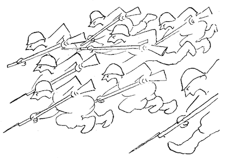

# thurber



[](https://clojars.org/com.github.atdixon/thurber)

[Apache Beam](https://beam.apache.org/) and 
[Google Cloud Dataflow](https://beam.apache.org/get-started/downloads/) on
~~steroids~~ Clojure.

_This is alpha software. Bleeding-edge and all that. API subject to mood swings._

* [Quickstart](#quickstart)
* [Project Goals](#project-goals)
* [Documentation](#documentation)
* [Demos](#demos)
    * [Word Count](#word-count)
    * [Mobile Gaming Example](#mobile-gaming-example)
* [Make It Fast](#make-it-fast)

## Quickstart

1. Clone &amp; `cd` into this repository.
2. `lein repl`
3. Copy &amp; paste:

```clojure
(ns try-thurber
  (:require [thurber :as t]
            [thurber.facade :as tf]
            [clojure.string :as str]))

(->
  (t/create-pipeline)
  (t/apply!
    (tf/read-text-file
      "demo/word_count/lorem.txt")
    (tf/fn* extract-words [sentence]
      (remove empty? (str/split sentence #"[^\p{L}]+")))
    (tf/count-per-element)
    (tf/fn* format-as-text
      [[k v]] (format "%s: %d" k v))
    (tf/log-sink))
  t/run!)
```

Output:

```
...
INFO thurber - extremely: 1
INFO thurber - undertakes: 1
INFO thurber - pleasure: 7
INFO thurber - you: 2
...
```

## Project Goals

* **Enable Clojure**
    * Bring Clojure's powerful, expressive toolkit (destructuring,
      immutability, REPL, async tools, etc etc) to Apache Beam.
* **REPL Oriented**
    * Functions are idiomatic Clojure functions by default. Build and test
      pipelines incrementally from the REPL. 
    * Evaluate/learn Beam semantics (windowing, triggering) interactively.
* **Avoid Macros**
    * Limit macro infection. Most thurber constructions are macro-less, use of macro
      constructions is optional.
* **No AOT!**
* **No Lock-in**
    * Pipelines can be composed of Clojure and Java transforms. 
      Incrementally refactor your pipeline to Clojure or back to Java.
* **Not Afraid of Java Interop**
    * Wherever Clojure's [Java Interop](https://clojure.org/reference/java_interop) 
      is performant and works cleanly with Beam, encourage it; facade functions
      are simple to create and left to your domain implementations.
* **Completeness**
    * Support all Beam capabilities (Transforms, State &amp; Timers, Side Inputs,
      Output Tags, etc.)
* **Performance**
    * Be finely tuned for data streaming.

## Documentation

* [Code walkthrough](./demo/walkthrough.clj)

## Demos

Each namespace in the `demo/` source directory is a pipeline written in Clojure
using thurber. Comments in the source highlight salient aspects of thurber usage.

These are the best way to learn thurber's API and serve as recipes for
various scenarios (use of tags, side inputs, windowing, combining,
Beam's State API, etc etc.)

To execute a demo, start a REPL and evaluate `(demo!)` from within the respective namespace.

### Word Count

The `word_count` package contains ports of Beam's
[Word Count Examples](https://beam.apache.org/get-started/wordcount-example/)
to Clojure/thurber.

### Mobile Gaming Example

Beam's [Mobile Gaming Examples](https://beam.apache.org/get-started/mobile-gaming-example/)
have been ported to Clojure using thurber.

These are fully functional ports but require deployment to GCP Dataflow. (How-to 
notes coming soon.)

## Make It Fast

First make your pipeline work. Then make it fast. 

Streaming/big data implies hot code paths. Use Clojure [type hints](https://clojure.org/reference/java_interop#typehints) 
liberally within your stream functions.

If deploying to GCP, use [Dataflow profiling](https://medium.com/google-cloud/profiling-dataflow-pipelines-ddbbef07761d)
to zero in on areas to optimize.

## References

* https://write.as/aaron-d/clojure-data-streaming-and-dodging-static-types

## License
Copyright © 2020 Aaron Dixon

Like Clojure distributed under the Eclipse Public License.
